# SMART-AFM Tutorial

[`SMART-AFM Paper` 📄][`BibTeX`][[`Dataset`](https://doi.org/10.1007/s10570-020-03618-4)]

[[`SMART Paper 📄`](https://doi.org/10.1007/s10570-020-03668-8)][[`SMART-TEM Paper 📄`](https://doi.org/10.1007/s10570-022-04818-w)]

Welcome to the SMART-AFM Image Analysis Tutorial! Here you’ll find a guide for turning your raw AFM scans into quantitative cellulose nanocrystal measurements. By the end, you’ll have all the tools and confidence to customize SMART-AFM for your own samples and generate results.

This tutorial provides a complete, step-by-step guide to using SMART-AFM for automated AFM image analysis. We begin by introducing the SMART-AFM framework [1. What is SMART-AFM?](#1-what-is-smart-afm) and then walk you through getting started [2. Getting Started](#2-getting-started) —from installing prerequisites and preparing your AFM data, to downloading the repository and setting it up. Next, you’ll learn how to define all pipeline settings in `defineParams.m`, before running the full SMART-AFM workflow on your image set [3. Running SMART-AFM](#3-running-smart-afm). We then explore the structured outputs you’ll find under `outputs/`in [4. Result Structure](#4-result-structure) in `outputs` —including preprocessed images, segmented overlays, grouped­ images, quantitative measurements, and image metadata. Finally, we cover parameter tuning and customization tips [5. Customization and Parameter Tuning](#5-customization-and-parameter-tuning),  troubleshooting [6. Troubleshooting Tips](#6-troubleshooting-tips), and a FAQ [FAQs](#faqs) to answer common questions.

For bugs or feature requests, open an issue in the repository or email repository maintainer.

### Citation

```latex
@article{karimi2025smartafm,
  title={A Semi-automatic Workflow for Atomic Force Microscopy Image Analysis and Cellulose Nanocrystal Particle Size Measurements},
  author={Karimi, Saba and Yucel, Sezen and Moon, Robert J. and Johnston, Linda J. and Bechle, Nathan J. and Batchelor, Warren and Chof, Jae-Young and Kalidindi, Surya R.},
  journal={},
  year={2025}
}
```

# 1. What is SMART-AFM?

SMART-AFM is an end-to-end, automated framework for converting raw AFM height maps into reliable, quantitative measurements of cellulose nanocrystals. It is built around a series of modular steps: first, **pre-processing** enhances the contrast and noise levels of the images, as well as addressing certain AFM imaging artifacts; next, **segmentation** distinguishes particles from background; **grouping** classifies each connected component as a border particle, coarse cluster, lateral (side-by-side) bundle, vertical stack, or isolated CNC based on shape and geometry criteria; and finally, **measurement** extracts dimensional data for particles. By automating every stage while still allowing parameter tuning, SMART-AFM delivers reproducible, high-throughput analysis and eliminates much of the time and subjectivity inherent in manual AFM image analysis.

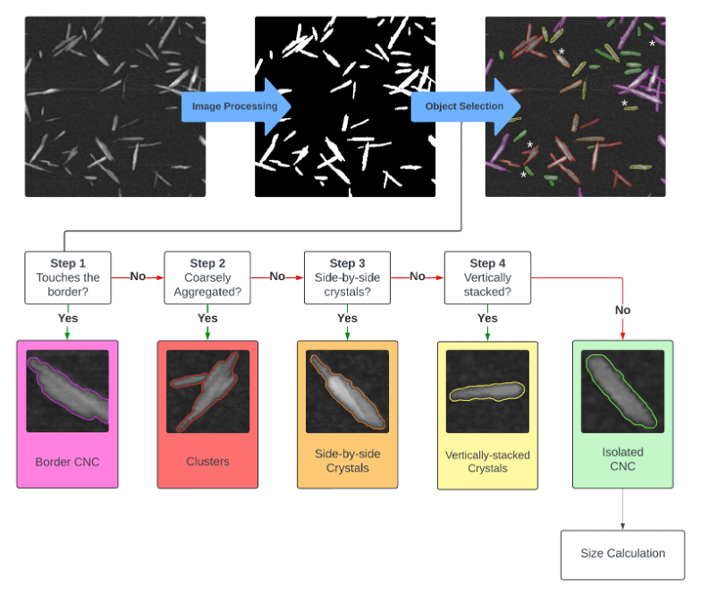

SMART-AFM Workflow. 

# 2. Getting Started

## 2.1. Prerequisites & Setting Up

- **MATLAB R2021a** or newer.
- Clone or download the `smart-afm` repository to MATLAB Drive, so you have:
    
    ```
    ~/smart-afm/
    ```
    
    If using MATLAB Online, place it in your MATLAB Drive folder so it syncs to the cloud. The project folder structure is modular and as follows:
    
    ```
    smart-afm/                  % root folder
    ├── src/                    % MATLAB functions and scripts
    │   ├── defineParams.m      
    │   ├── runSmartAfm.m       
    │   ├── loadSmartImages.m   
    │   ├── imageProcessing.m   
    │   ├── particleGrouping.m  
    │   ├── measureParticles.m  
    │   └── prepareOutputs.m    
    ├── data/                   % folder where users place their AFM images
    ├── outputs/                % where results, masks, and plots will be saved
    └── tutorial/               % this tutorial document (Smart_AFM_Tutorial.pdf)
    ```
    

## 2.2. AFM Data Preparation

While **preparing AFM images**, note that

- All AFM images must share the same dimensions (e.g., 512 × 512 px)
- All AFM images must share the same magnification so that the pixel length ($\text{nm/pixel}$) is consistent across the dataset. Pixel length data is available from microscope’s software or the image metadata. Make sure the chosen magnification yields a pixel size compatible with CNC dimensions—for example, $0.30 \text{ nm/pixel}$ gives only a $\sim1.5\%$ width error on a $6 \text{ nm}$ particle. For wood‐based CNCs, we recommend $≤ 0.3 \text { nm/pixel}$ ([Meija et al, 2020](https://doi.org/10.1021/acs.analchem.0c02805)).

## 2.3. Folder Structure

- **Place** all raw AFM images into the following directory:
    
    ```bash
    smart-afm/data/
    ```
    
    The code does not recognizes the files inside a sub-folder—drop every file into `data/`. Accepted file extensions are `.txt` , `.png` , `.tiff`, `.tif`, `.jpg`, and `.mat`.
    
- **Keep all `.m` code files** in directory:
    
    ```bash
    smart-afm/src/
    ```
    

## 2.4. Configuring MATLAB Path

To run the full SMART-AFM pipeline:

1. Start MATLAB and set your **current folder** to the `smart-afm/` folder.
2. Add the entire project (including all subfolders) to MATLAB’s search path by running:
    
    ```bash
     addpath(fullfile(pwd,'data')); 
     addpath(fullfile(pwd,'src'));
    ```
    
    This ensures MATLAB finds all functions under `src/` and image under `data/` .
    
3. Verify that `runSmartAfm` is on the path by running:
    
    ```bash
    which runSmartAfm
    ```
    
    You should see something like:
    
    ```bash
    /Users/yourusername/smart-afm/src/runSmartAfm.m
    ```
    

## 2.5. Defining Parameters and Configuration (`defineParams.m`)

SMART’s flexibility and accuracy come from a single`params` *structure array* that contains both **tunable algorithmic parameters** (for image processing and particle grouping), **essential metadata entries** (such as pixel length in nanometers), and **user configurations** (like which particle groups to measure). 

All pipeline parameters are defined in a file called `defineParams.m` within `src/`. Every configurable parameter in `params` *struct* is a *field* whose name indicates which module it belongs to. For example:

- **`params.seg.*`** holds all segmentation parameters,
- **`params.ref.*`** holds segmentation-refinement‐step settings,
- **`params.group.*`** holds grouping thresholds,
- and so on.

This naming convention keeps the pipeline modular—each processing stage reads only the `params` fields it needs. The values in `defineParams.m` are the defaults used in the SMART-AFM publication—adjusting them for a given image set is recommended. For full details on why each parameter was chosen, please refer to the SMART-AFM paper. A later discussion and practical recommendation on parameter selection is given in [5. Customization and Parameter Tuning](#5-customization-and-parameter-tuning).

**⚠️ IMPORTANT**: You *must* set your raw image dimensions before running SMART. In `defineParams.m`, specify:

```matlab
% initialization
params.imgDim    = 512;  
							% number of pixels per side (e.g. 512 for a 512×512 image)
params.imageSize = 1000; 
							% physical field of view in nm (e.g. 1000 for a 1000×1000 nm² scan)
```

Additionally, specify the group of particles you require measurements from here: 

```matlab
% measurement
params.groupList = {'isolated'};  
							% Choose any subset of: 'lateral','vertical','isolated'
```

# 3. Running SMART-AFM

To run the full SMART-AFM pipeline:

1. Start MATLAB and ensure your **current folder** is the repository root (`smart-afm/`).
2. Run the main script:
    
    ```matlab
    runSmartAfm;
    ```
    

That single command will:

- Load every file from `data/` ,
- Preprocess, segment, refine, group, and measure CNCs, as explained in detail in the paper, while displaying cumulative average statistic of processed images online, and
- Save results in `outputs/` .

<table>
  <tr>
    <td align="center">
      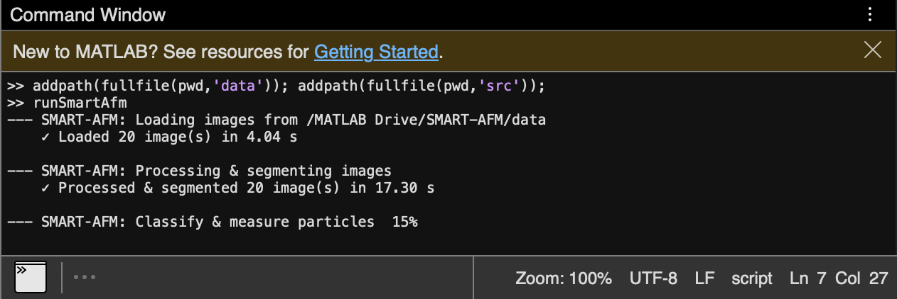
      <p>As SMART is running, time taken to process images is reported, as well as a progress bar.</p>
    </td>
    <td align="center">
      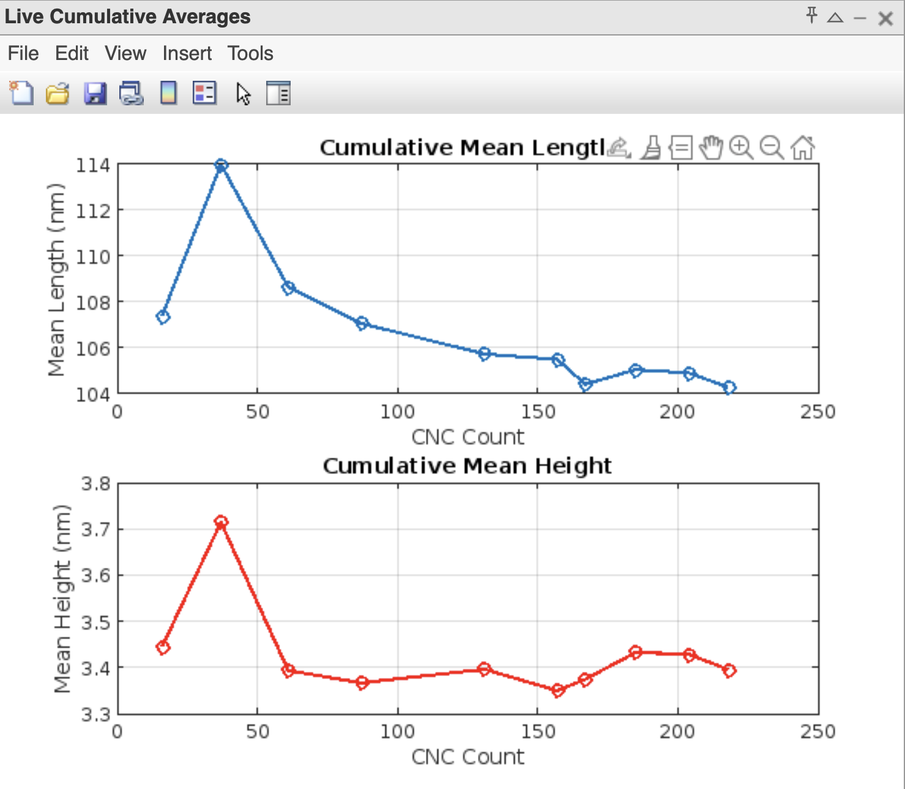
      <p>Live cumulative average length and height measurements as each image is processed.</p>
    </td>
  </tr>
</table>

# 4. Result Structure

When you run `runSmartAfm`, the code builds an `outputs/` folder under your project root with a structure as follows:

```
smart-afm/outputs/     
├── preprocessed_images/                      % processed images (png)
│   └── <name>_preprocessed.png
├── segmented_images/                         % segmented, binary images (png)
│   └── <name>_segmented.png
├── grouped_images/                           % displays particle groupings as overlays on raw images (png)
│   └── <name>_grouped.png
├── measurements/
│   ├── <requested_group>/
│   │   ├── <requested_group>_length_hist.png
│   │   ├── <requested_group>_height_hist.png
│   │   ├── <requested_group>_aspect_ratio_hist.png
│   │   ├── <requested_group>_length_height_heatmap.png
│   │   └── <requested_group>_measurements.csv
│   ├── all/
│   │   ├── all_length_hist.png
│   │   ├── all_height_hist.png
│   │   ├── all_aspect_ratio_hist.png
│   │   ├── all_length_height_heatmap.png
│   │   └── all_measurements.csv
│   ├── summary_measurements.csv
│   ├── all_cumulative_mean_length.png
│   └── all_cumulative_mean_height.png
└── image_metadata/
    └── image_metadata.csv
```

## 4.1. `outputs/preprocessed_images/`

PNGs of each preprocessed AFM image (`<name>_preprocessed.png`). 

## 4.2. `outputs/segmented_images/`

PNGs of binary segmented images, i.e., CNC pixels separated from non-CNC pixels (`<name>_segmented.png`). 

## 4.3. `outputs/grouped_images/`

PNGs of raw images overlaid with colored boundaries by group (`<name>_grouped.png`) with color reference below. 
<table>
  <tr>
    <td width="20%" align="center">
      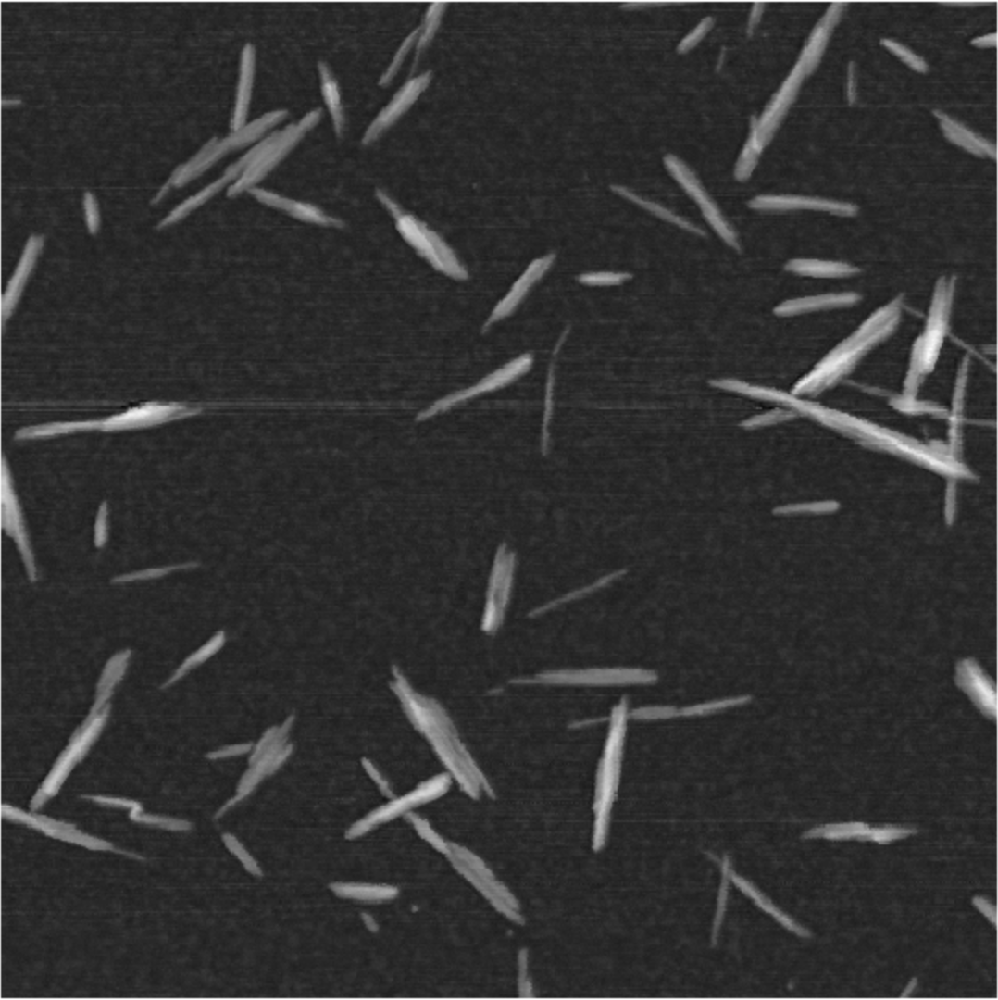
      <p>Example of a raw image.</p>
    </td>
    <td width="20%" align="center">
      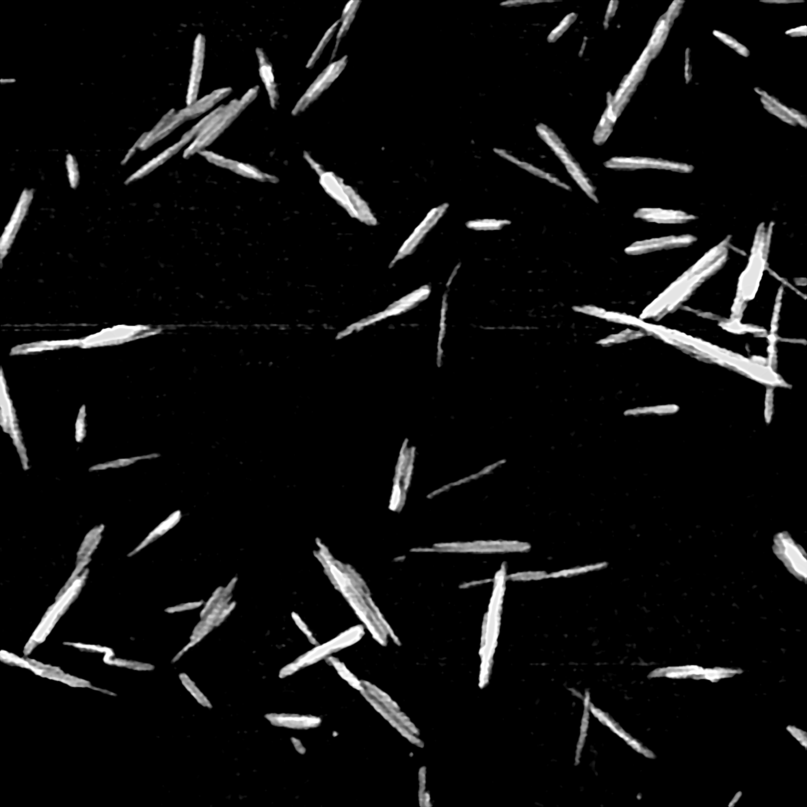
      <p>The grayscale, preprocessed image.</p>
    </td>
    <td width="20%" align="center">
      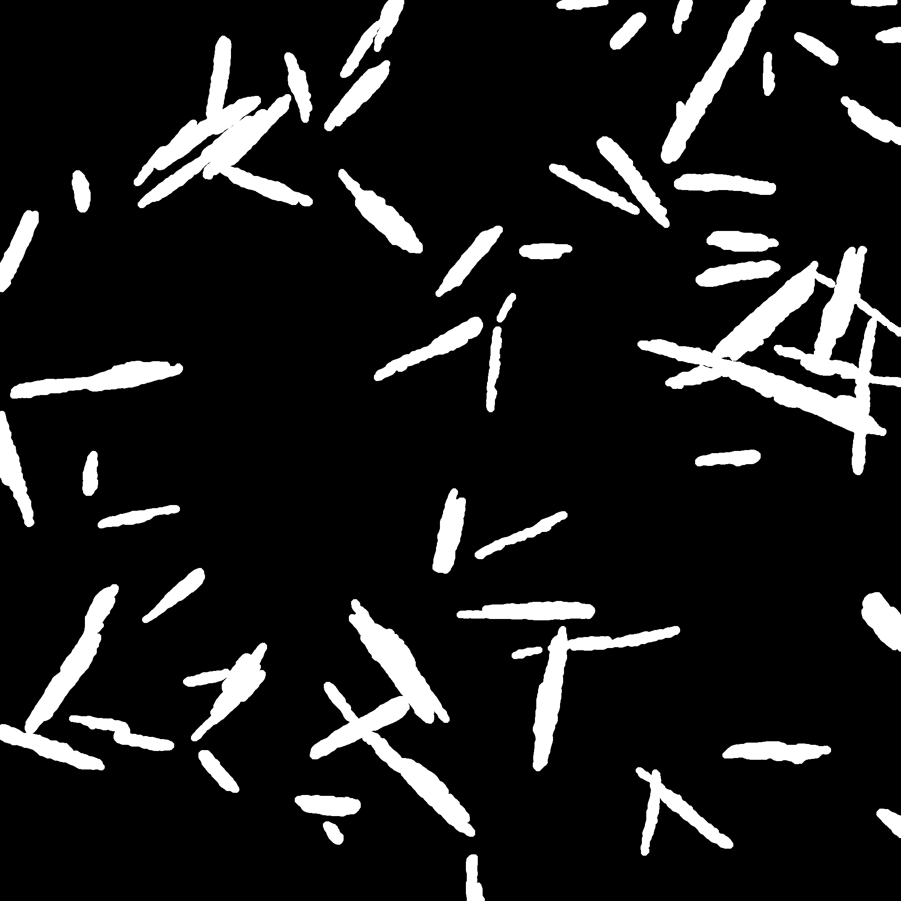
      <p>The segmented image.</p>
    </td>
    <td width="20%" align="center">
      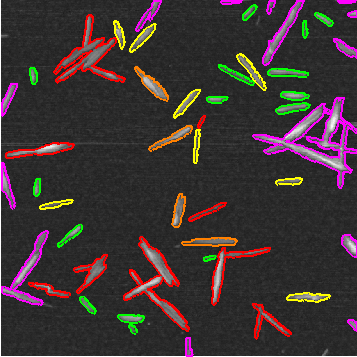
      <p>Image with segmentation overlays with grouping-specific colors.</p>
    </td>
    <td width="20%" align="left">
      <aside>
        🎨  
        <strong>Color reference:</strong><br/>
        Magenta: border<br/>
        red: coarse clusters<br/>
        orange: laterally stacked<br/>
        yellow: vertically stacked<br/>
        green: isolated
      </aside>
    </td>
  </tr>
</table>

## 4.4. `outputs/measurements/`

- `summary_measurements.csv` — one CSV summarizing mean and standard deviation for each requested group in `params.groupList` (e.g. `isolated`, `vertical`) and overall `all`(rows: `<group>_average`,`<group>_std`,`all_average`,`all_std`).
- `all_cumulative_mean_length.png` and `all_cumulative_mean_height.png` — cumulative measurement of all particles in one-image increments.
- A subfolder for each requested group in `params.groupList` (e.g. `isolated/`, `vertical/`), as well as aggregated per‑particle for all requested group `all/`, each containing:
    - `<group>_measurements.csv` — per‑particle metrics for that group. The length, height, aspect ratio, solidity (ratio of the pixels in the convex hull that are also in the object), 3D area, 2D area, and group assignment.
    - `<group>_<size metric>_hist.png` and `<group>_<size metric>_heatmap.png` — PNG figures: length, height, aspect ratio histograms and a 2D heatmap of length vs. height.

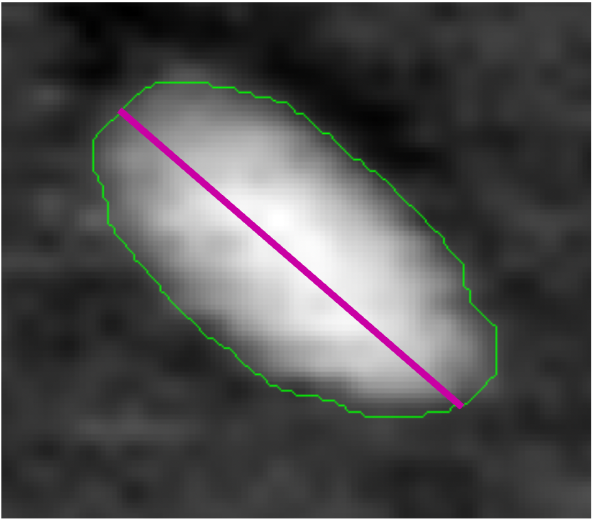

Purple line reflects particle’s ***length***. ***Area 2D*** is the area of the pixels inside the green boundary.

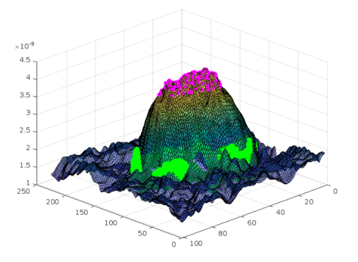

A particle in 3D. Purple dots reflect the highest points on the object which are averaged to calculate particle’s ***height***. Object’s ***3D area*** is the surface enclosed by green boundary. 

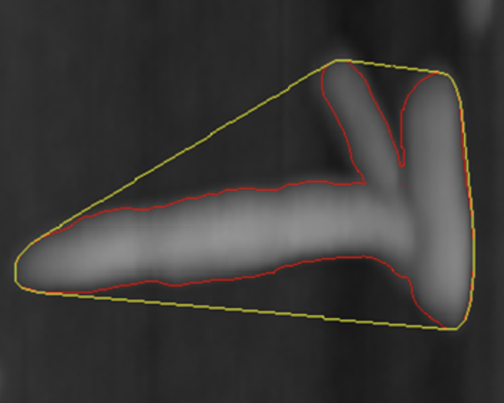

A particle’s ***solidity*** is the ratio of pixels belonging to the object by the pixels inside object’s convex hull, i.e., pixels inside red area to pixels inside yellow area.

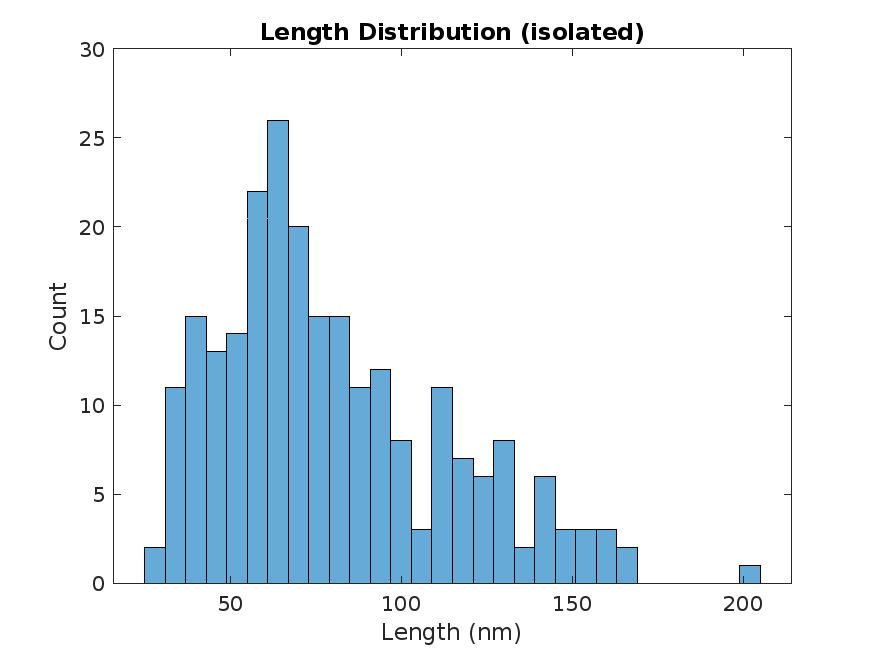

Sample measurement histogram PNG.

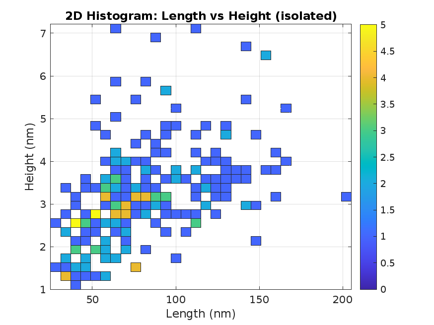

Sample measurement heat map PNG.

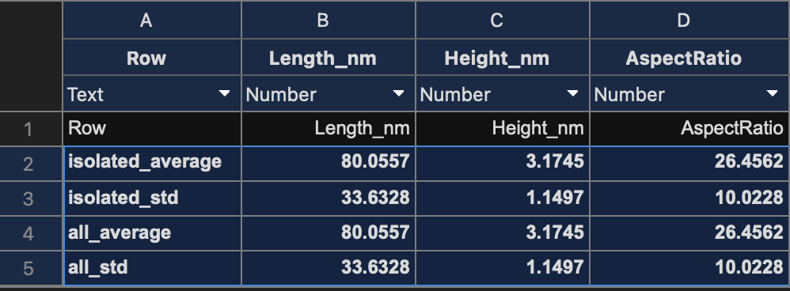

Sample measurement summary statistics CSV. (truncated)

## 4.5. `outputs/image_metadata/`

`image_metadata.csv` — per-image summary metrics (background roughness, noise, contrast, background height, particle counts and total area for each group).


***Background roughness*** is the 3D surface area of background pixels divided by their projected area. 


***Background noise*** is defined as the standard deviation of background pixels in a given image. ***Contrast*** is the difference between averages of background and particle pixels in the image. ***Background height*** is the average of an image’s background pixels.

# 5. Customization and Parameter Tuning

- Inspect preprocessed images in `outputs/preprocessed_images/` to confirm preprocessing quality: better particle visibility, less image noise, etc.—the quality of preprocessed images is usually a strong indicator of segmentation success.
    
    Adjust preprocessing parameters in `defineParameters.m` if needed.
    
    - Set `params.upsampleFactor` to an integer value such that the pixel length in nanometers is roughly $0.5$ nm. Adjust `params.gaussianSigma` accordingly to smooth the image.
    - `params.maxDelta` clips AFM height range above certain values to account for certain AFM artifacts. Adjust according to expected CNC height (thickness) in AFM.
    - `params.fftHighPassCutoff` controls the allowed image frequencies with an FFT filter. Smaller frequencies are related to image noise, while higher frequencies account for particle pixels. A higher cutoff removes more image signals, such as those belonging to particle pixels.
    - `params.sharpeningRadius` and `params.sharpeningAmount` control the sharpening degree required after the previous smoothing steps, but will introduces some noise.
    - Finally, `params.medianFilterSize`  concludes image processing by further reducing noise while preserving edges.
- Inspect segmented images in `outputs/segmented_images/`to confirm segmentation accuracy.
    - The `params.seg.window` parameter controls the size of the local neighborhood used for adaptive thresholding and should be chosen relative to expected CNC dimensions. A wide range usually produces acceptable results—between $5\times\text{expected CNC width}$ and  $2\times\text{expected CNC length}$. A smaller window risks segmenting noise as particle (false positives); a larger window yields smoother, tighter boundaries but may shave off real edge pixels of the CNC, resulting in underestimated CNC length.
    - If there are too many tiny noise blobs segmented as particles, increase `params.seg.minAreaFrac` .
    - Intensity thresholds `params.ref.intensityThreshLc` and `params.ref.intensityThreshGl` remove segmentation false positives as well as reject low contrast CNCs. If too many CNCs are missing, reduce these thresholds.
- Inspect particle grouping performance in `outputs/grouped_images/`.
    - Adjust accepted length, height and solidity range in `params.group.coarse.lengthSize`, `params.group.coarse.heightSize` and `params.group.coarse.solidity` based on accepted CNC size and geometry.
    - `params.group.lateral.feretThresh` controls how pronounced a “step” in the particle width must be before classifying it as a lateral bundle. A higher threshold will only pick out particles with very sharp, well‐defined steps, while a lower threshold is more permissive and may include milder width fluctuations. When working with lower‐resolution images—where pixelation can blur the stepped edge—it’s often necessary to raise this threshold to avoid false positives from background noise.
    - `params.group.vertical.stepThresh` sets the minimum relative height change (as a fraction of the object’s overall height range) required to register a “step” along the major axis. Raising this threshold means only very pronounced vertical stacks will be detected; lowering it will catch subtler height differences but risks false positives on noisy surfaces. `params.group.vertical.windowsize` defines the length (in pixels) of the 1D convolution kernel used to smooth the height profile before step detection. A larger window smooths over small fluctuations—helpful for noisy or low‐resolution images—but may blur short steps. A smaller window preserves fine detail at the cost of increased sensitivity to noise. `params.group.vertical.margin` excludes a fraction of pixels at each end of the height‐profile strip from step analysis (to avoid edge artifacts). Increasing margin ignores more of the particle ends—useful when the ends taper more gradually—while decreasing it includes more data but may pick up spurious edge variations.

# 6. Troubleshooting Tips

- You can isolate a function in the command window to understand where SMART fails.
    
    ```matlab
    [imgPre, imgRawUp] = preprocessImage(imgRaw, params);
    ```
    
- To display any image `img`, use.
    
    ```matlab
    imshow(img, []);
    ```
    

# FAQs

**Q1: How should I start when analyzing a new image dataset?**

A: Begin by running SMART on a single representative image. This lets you execute all steps end-to-end, visualize segmentation, grouping, and measurements, and adjust parameters until you’re confident in the results.

**Q2: How do I validate parameters across multiple images?**

A: After tuning on one image, process a batch of ~10 typical images. Inspect the segmentation, grouping, and CNC identification for each file. Adjust parameters to improve correct identifications and minimize misses (see Yucel [2021](https://doi.org/10.1007/s10570-020-03668-8)/[2022](https://doi.org/10.1007/s10570-022-04818-w), Karimi 2025 for guidance).

**Q3: Why might SMART miss or misidentify some CNCs?**

A: Even with optimal parameters and high-quality images, SMART can miss a fraction of isolated CNCs, cut off thin “tails,” or mistake fragments for CNCs. As long as the true‐positive rate is high, SMART measurements match manual ones closely, but maintain healthy skepticism and spot‐check results.

**Q4: How was SMART workflow validated?**

A: The SMART-AFM pipeline was benchmarked against the inter-laboratory comparison (ILC) study by Bushell et al. (2021) [[link to paper](https://doi.org/10.1007/s10570-020-03618-4)], which assessed isolated CNC measurements across multiple labs using a certified reference material. SMART-AFM’s length, height, and aspect-ratio results for isolated particles agreed closely with the ILC’s reports, demonstrating that the automated workflow reproduces manual, multi-laboratory measurements with high fidelity.

**Q5: Can SMART measure particles other than isolated CNCs?**

A: Yes. By default, SMART reports measurements for isolated particles only. To include agglomerated groups (coarse clusters, bundles, vertical stacks), modify the code to collect measurements from those group indices as well. 

In `defineParameters.m` modify: 

```markup
params.groupList = {'isolated'};
```

Choose any subset of: `'lateral'`, `'vertical'`, `'isolated'` . Include matching single or double quotation marks.

**Q6: How do I ensure consistent pixel calibration?**

A: All images must share the same magnification and pixel dimensions. Manually enter image size (e.g., 512×512 px) and physical field of view (e.g., 1000×1000 nm²) in `defineParams.m` so that the measurements are correct for every image. The entire SMART pipeline—from preprocessing to CNC selection criteria and final measurements—relies on accurate pixel‐to‐nm calibration. If the pixel length is incorrect, every step (filter sizes, threshold windows, size cutoffs) and all reported CNC dimensions will be incorrect.

**Q7: What image quality is required for reliable results?**

A: Ideally, images should have:

1. Well‐dispersed CNCs with minimal aggregation.
2. High edge contrast (bright CNCs on dark background).
3. Low background noise (background pixels should have low grayscale variance).

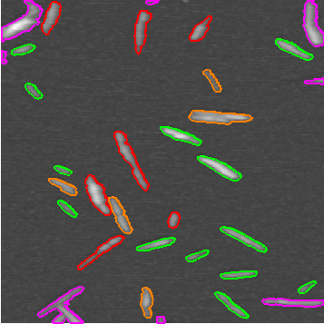

Example 1: a low-noise, high contrast, low artifact image. SMART performs well on this image.

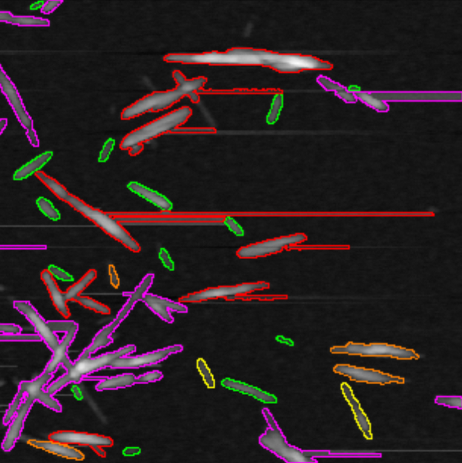

Example 2: SMART’s image segmentation and grouping is negatively impacted with artifacts present. (bright horizontal streak artifacts)

**Q8: How can SMART-AFM perform multi-batch analysis?**

A: SMART-AFM processes whatever set of images you place in `data/` in a single run—it does **not** automatically merge results from multiple runs. If you analyze your dataset into batches, you will need to combine the resulting `summary_measurements.csv` files yourself (either in Excel or in MATLAB) and then regenerate any cross-batch statistics or plots. For example, if you have

```matlab
batch1_summary_measurements.csv
batch2_summary_measurements.csv
```

in your current MATLAB folder or path (where the files above are stored), run:

```matlab
% List all batch summary file names
files = {'batch1_summary_measurements.csv', 'batch2_summary_measurements.csv'};

combined = table(); 

for k = 1:numel(files)
    T = readtable(files{k}, 'ReadRowNames', true);
    % Append a suffix so row names remain unique
    [~, base] = fileparts(files{k});          % e.g. 'batch1_summary_measurements'
    T.Properties.RowNames = strcat(T.Properties.RowNames, "_", extractBefore(base, '_summary'));
    combined = [combined; T];  
end

writetable(combined, 'all_batches_summary_measurements.csv', 'WriteRowNames', true); % Save the table
```

This will produce `all_batches_summary_measurements.csv` ready for any further analysis or plotting.


Sample `all_batches_summary_measurements.csv` for a 2-batch analysis produced by code excerpt above.

**Q9: How is SMART-AFM is different from SMART-TEM [[link to paper](https://doi.org/10.1007/s10570-022-04818-w)]?**

A: AFM images are vastly different from TEM images (e.g., image format, resolution, contrast, noise, imaging artifacts, height measurement, etc.) and thus require different procedures for image analysis then what was used in the original SMART and SMART-TEM framework. This current work describes the development of SMART-AFM, optimized for AFM images, which includes, upscaling pixel density of images, improved image segmentation and thresholding, more rigorous set of shape metrics to identify CNC particles, improved object boundary capturing for increase accuracy of object size measurement, and accounting for AFM imaging artifacts.
